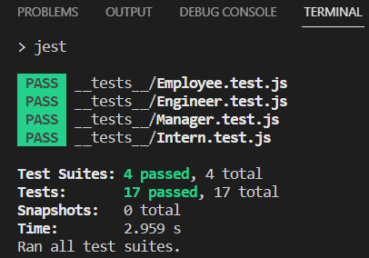
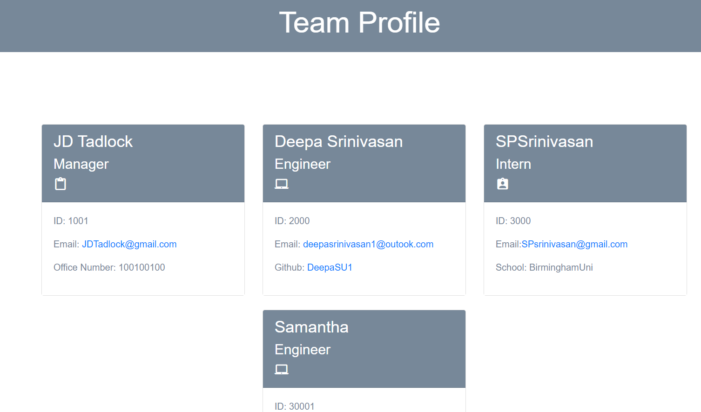

# Team-profile-generator

##Description

The Team Profile Generator is used to generate profiles for a work team. It will prompt for entering Manager details and his team member details including name, ID, email. If employee type chosen is Engineer then it prompts their github name and school name for employee of type intern.

##Installation Instructions

To install, clone the repository via github. Then download Node.js.
Also install Test package jest, using command npm -i jest

##Usage Instructions

Startup the team-profile-generator with a command prompt interface, then type "npm install" to install packages for node modules. After module installations, run the application from the command line "node index.js" and proceed through the command prompt to create your Team Profile.

##Testing

Type command npm test, after changing the node js package script to jest 
<picture>

</picture>

##Preview of app final product
Sample output html generated can be viewed below 
<picture>

</picture>
